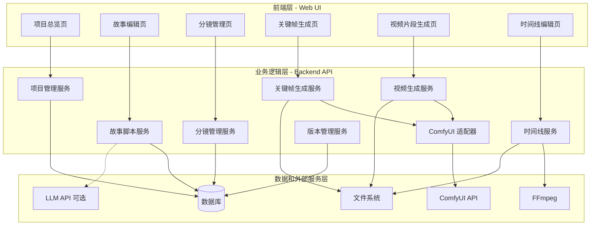

# Design Document

## Overview

AI 视频生成管理系统是一个基于 Web 的本地管理平台，为个人和小团队提供从创意到成片的完整视频制作工作流。系统采用分层架构设计，将视频制作过程分解为 6 个独立但相互关联的层次，每个层次都可以独立编辑、版本管理和回溯。

核心设计理念：
- **渐进式工作流**：从抽象到具体，从文字到图像再到视频
- **灵活可回溯**：任何层级的修改都不会强制覆盖下游产物
- **衔接优先**：强调镜头间的视觉连贯性，支持帧级别的衔接控制
- **版本管理**：所有实体都支持多版本保存和对比
- **Demo/正式分离**：支持快速预览和高质量正式生成两种模式

技术栈：
- 前端：现代 Web 框架（React/Vue）+ 时间线编辑组件
- 后端：Python/Node.js REST API
- AI 引擎：ComfyUI（通过 HTTP API 调用）
- 数据存储：关系型数据库（PostgreSQL/SQLite）+ 文件系统
- 视频处理：FFmpeg

## Architecture

系统采用三层架构：



### 核心架构原则

1. **层次隔离**：每个页面对应一个独立的服务模块，降低耦合
2. **统一适配**：所有 ComfyUI 调用通过适配器层统一管理
3. **异步处理**：图片和视频生成采用异步任务模式，支持进度追踪
4. **文件与元数据分离**：生成的图片/视频存储在文件系统，元数据存储在数据库

## Components and Interfaces

### 1. 前端组件

#### ProjectListView（项目总览页）
- 职责：展示和管理项目列表
- 主要功能：
  - 项目列表展示（卡片或表格视图）
  - 新建/复制/归档/删除项目
  - 项目搜索和筛选
- API 调用：
  - `GET /api/projects` - 获取项目列表
  - `POST /api/projects` - 创建新项目
  - `POST /api/projects/{id}/duplicate` - 复制项目
  - `DELETE /api/projects/{id}` - 删除项目

#### StoryEditorView（故事编辑页）
- 职责：编辑故事大纲和场景脚本
- 主要功能：
  - 故事大纲编辑器（Hook/中段/结尾）
  - 场景列表管理
  - 旁白文本编辑（支持多版本）
  - LLM 辅助生成按钮
- API 调用：
  - `GET /api/projects/{id}/story` - 获取故事内容
  - `PUT /api/projects/{id}/story` - 更新故事大纲
  - `POST /api/projects/{id}/scenes` - 创建场景
  - `PUT /api/scenes/{id}` - 更新场景
  - `POST /api/scenes/{id}/generate-script` - LLM 生成脚本

#### StoryboardView（分镜管理页）
- 职责：管理镜头列表和衔接关系
- 主要功能：
  - 场景时间轴展示
  - 镜头列表（支持拖拽排序）
  - 镜头详细信息编辑表单
  - 衔接关系可视化
  - 批量操作（风格设置、导出）
- API 调用：
  - `GET /api/projects/{id}/shots` - 获取镜头列表
  - `POST /api/projects/{id}/shots` - 创建镜头
  - `PUT /api/shots/{id}` - 更新镜头
  - `PUT /api/shots/reorder` - 批量更新顺序
  - `GET /api/projects/{id}/shots/export` - 导出分镜表

#### KeyframeGeneratorView（关键帧生成页）
- 职责：生成和管理镜头关键帧
- 主要功能：
  - 镜头列表（带缩略图）
  - 关键帧预览网格
  - Prompt 编辑器（自动生成 + 手动修改）
  - ComfyUI Workflow 选择器
  - 参数表单（steps/cfg/seed 等）
  - 版本管理面板
  - 角色/风格批量应用
- API 调用：
  - `GET /api/shots/{id}/keyframes` - 获取关键帧列表
  - `POST /api/shots/{id}/generate-keyframes` - 生成关键帧
  - `PUT /api/keyframes/{id}/select` - 选定关键帧
  - `GET /api/shots/{id}/prompt` - 获取自动生成的 Prompt

#### ClipGeneratorView（视频片段生成页）
- 职责：生成和管理视频片段
- 主要功能：
  - 镜头列表（带关键帧和 Clip 状态）
  - 视频播放器
  - 输入模式切换（图生视频/文生视频）
  - 参数设置表单
  - 衔接控制选项
  - Demo/正式模式切换
  - 版本对比
- API 调用：
  - `GET /api/shots/{id}/clips` - 获取 Clip 列表
  - `POST /api/shots/{id}/generate-clip` - 生成视频片段
  - `PUT /api/clips/{id}/select` - 选定使用版本
  - `GET /api/clips/{id}/status` - 查询生成状态

#### TimelineEditorView（时间线编辑页）
- 职责：编辑时间线并导出成片
- 主要功能：
  - 时间线轨道（视频主轨 + 音频轨）
  - Clip 拖拽和裁剪
  - 音频波形显示
  - 转场标记
  - 旁白文本对照
  - 导出选项（合成视频/工程文件）
- API 调用：
  - `GET /api/projects/{id}/timeline` - 获取时间线
  - `PUT /api/projects/{id}/timeline` - 更新时间线
  - `POST /api/projects/{id}/timeline/export-video` - 导出合成视频
  - `POST /api/projects/{id}/timeline/export-project` - 导出工程文件
  - `POST /api/projects/{id}/timeline/versions` - 保存时间线版本

### 2. 后端服务

#### ProjectService
- 职责：项目 CRUD 和生命周期管理
- 主要方法：
  - `createProject(data)` - 创建项目
  - `getProject(id)` - 获取项目详情
  - `listProjects(filters)` - 列出项目
  - `duplicateProject(id)` - 复制项目（深拷贝所有关联数据）
  - `deleteProject(id)` - 删除项目

#### StoryService
- 职责：故事和场景管理
- 主要方法：
  - `getStory(projectId)` - 获取故事内容
  - `updateStory(projectId, data)` - 更新故事大纲
  - `createScene(projectId, data)` - 创建场景
  - `updateScene(sceneId, data)` - 更新场景
  - `generateScript(sceneId, llmProvider)` - 调用 LLM 生成脚本

#### ShotService
- 职责：镜头管理和分镜表生成
- 主要方法：
  - `listShots(projectId)` - 获取镜头列表
  - `createShot(projectId, data)` - 创建镜头
  - `updateShot(shotId, data)` - 更新镜头
  - `reorderShots(shotIds)` - 批量更新顺序
  - `exportStoryboard(projectId, format)` - 导出分镜表（CSV/JSON）

#### KeyframeService
- 职责：关键帧生成和管理
- 主要方法：
  - `generatePrompt(shotId)` - 根据分镜信息生成 Prompt
  - `generateKeyframes(shotId, params)` - 调用 ComfyUI 生成关键帧
  - `listKeyframes(shotId)` - 获取关键帧列表
  - `selectKeyframe(keyframeId)` - 选定关键帧
  - `getKeyframeVersions(shotId)` - 获取版本历史

#### ClipService
- 职责：视频片段生成和管理
- 主要方法：
  - `generateClip(shotId, params)` - 调用 ComfyUI 生成视频
  - `listClips(shotId)` - 获取 Clip 列表
  - `selectClip(clipId)` - 选定使用版本
  - `getClipStatus(clipId)` - 查询生成状态
  - `extractFrame(clipId, frameNumber)` - 提取指定帧

#### TimelineService
- 职责：时间线编辑和视频导出
- 主要方法：
  - `getTimeline(projectId)` - 获取时间线
  - `updateTimeline(projectId, data)` - 更新时间线
  - `exportVideo(projectId, params)` - 调用 FFmpeg 合成视频
  - `exportProjectFile(projectId, format)` - 导出工程文件（EDL/XML/JSON）
  - `saveTimelineVersion(projectId, name)` - 保存时间线版本

#### ComfyUIAdapter
- 职责：封装 ComfyUI API 调用
- 主要方法：
  - `loadWorkflows()` - 从配置加载 Workflow 定义
  - `submitPrompt(workflowName, params)` - 提交生成任务
  - `getTaskStatus(taskId)` - 查询任务状态
  - `getTaskResult(taskId)` - 获取生成结果
  - `buildWorkflowJSON(workflowName, overrides)` - 组装 Workflow JSON

#### VersionService
- 职责：通用版本管理
- 主要方法：
  - `createVersion(entityType, entityId, data)` - 创建版本
  - `listVersions(entityType, entityId)` - 列出版本历史
  - `restoreVersion(versionId)` - 恢复到指定版本
  - `compareVersions(versionId1, versionId2)` - 对比两个版本

#### LLMService
- 职责：调用 Poe API 进行文本生成
- 主要方法：
  - `generateStoryOutline(projectDescription)` - 根据项目简介生成故事大纲
  - `generateSceneScript(sceneDescription, outline)` - 根据场景描述和大纲生成旁白脚本
  - `optimizePrompt(shotDescription)` - 优化镜头描述为英文 Prompt
  - `compressVoiceover(text, targetDuration)` - 压缩旁白文本到目标时长
- 配置：
  - API Key（从环境变量或配置文件读取）
  - 模型名称（可配置，默认 gpt-5.1）
  - 请求超时和重试策略

### 3. 外部接口

#### ComfyUI HTTP API
- `POST /prompt` - 提交生成任务
  - 请求体：Workflow JSON + 参数覆盖
  - 返回：`{ prompt_id: string }`
- `GET /history/{prompt_id}` - 查询任务历史
  - 返回：任务状态和输出文件路径
- `WebSocket /ws` - 实时进度推送（可选）

#### FFmpeg CLI
- 视频合成：`ffmpeg -i concat.txt -c copy output.mp4`
- 帧提取：`ffmpeg -i video.mp4 -vf "select=eq(n\,{frame})" -vframes 1 frame.png`

#### LLM API
- 使用 Poe API 进行故事生成和 Prompt 优化
- 端点：`https://api.poe.com/v1/chat/completions`
- 支持配置模型名称（如 gpt-5.1）和 API Key
- 请求格式：
  ```json
  {
    "model": "gpt-5.1",
    "messages": [
      {"role": "user", "content": "prompt text"}
    ]
  }
  ```

## Data Models

### Project（项目）
```typescript
interface Project {
  id: string;
  name: string;
  type: string; // "产品介绍" | "剧情短片" | "MV" 等
  targetDuration: number; // 秒
  targetStyle: string;
  targetAudience: string;
  notes: string;
  status: "draft" | "in_progress" | "completed" | "archived";
  createdAt: Date;
  updatedAt: Date;
}
```

### Story（故事）
```typescript
interface Story {
  id: string;
  projectId: string;
  hook: string; // 开场 Hook
  middleStructure: string; // 中段结构
  ending: string; // 结尾
  version: number;
  createdAt: Date;
  updatedAt: Date;
}
```

### Scene（场景）
```typescript
interface Scene {
  id: string;
  projectId: string;
  sceneNumber: number;
  title: string;
  description: string;
  estimatedDuration: number; // 秒
  voiceoverText: string;
  dialogueText: string;
  notes: string;
  version: number;
  createdAt: Date;
  updatedAt: Date;
}
```

### Shot（镜头）
```typescript
interface Shot {
  id: string;
  projectId: string;
  sceneId: string;
  shotId: string; // 如 "S1-01"
  sequenceNumber: number;
  duration: number; // 秒
  shotType: "wide" | "medium" | "closeup" | "transition";
  description: string;
  
  // 视觉元素
  environment: string; // 室内/室外、时间等
  subject: string; // 角色描述
  action: string; // 动作描述
  cameraMovement: string; // 推/拉/摇/移等
  lighting: string; // 光线氛围
  style: string; // 风格标签
  
  // 衔接信息
  previousShotId: string | null;
  nextShotId: string | null;
  transitionType: "cut" | "dissolve" | "motion";
  useLastFrameAsFirst: boolean; // 上一镜尾帧 = 本镜首帧
  
  // 关联
  relatedVoiceover: string;
  importance: "high" | "medium" | "low";
  
  createdAt: Date;
  updatedAt: Date;
}
```

### Keyframe（关键帧）
```typescript
interface Keyframe {
  id: string;
  shotId: string;
  version: number;
  
  // 生成参数
  prompt: string; // 最终使用的 Prompt
  negativePrompt: string;
  workflowName: string;
  steps: number;
  cfg: number;
  sampler: string;
  resolution: { width: number; height: number };
  seed: number;
  
  // 结果
  imagePath: string;
  isSelected: boolean; // 是否为当前选定的关键帧
  
  createdAt: Date;
}
```

### Clip（视频片段）
```typescript
interface Clip {
  id: string;
  shotId: string;
  version: number;
  
  // 输入
  inputMode: "image_to_video" | "text_to_video";
  keyframeId: string | null; // 如果是图生视频
  prompt: string;
  
  // 生成参数
  workflowName: string;
  duration: number; // 秒
  fps: number;
  resolution: { width: number; height: number };
  steps: number;
  guidance: number;
  cfg: number;
  seed: number;
  
  // 衔接控制
  useLastFrameReference: boolean;
  referenceClipId: string | null;
  referenceFrameNumber: number | null;
  
  // 模式
  mode: "demo" | "production";
  
  // 结果
  videoPath: string;
  status: "pending" | "processing" | "completed" | "failed";
  comfyuiTaskId: string | null;
  isSelected: boolean; // 是否为当前使用版本
  
  createdAt: Date;
  completedAt: Date | null;
}
```

### Timeline（时间线）
```typescript
interface Timeline {
  id: string;
  projectId: string;
  version: number;
  versionName: string;
  
  // 轨道配置
  tracks: TimelineTrack[];
  
  // 音频
  voiceoverAudioPath: string | null;
  bgmAudioPath: string | null;
  
  createdAt: Date;
  updatedAt: Date;
}

interface TimelineTrack {
  trackId: string;
  trackType: "video" | "audio";
  items: TimelineItem[];
}

interface TimelineItem {
  itemId: string;
  clipId: string; // 关联到 Clip
  startTime: number; // 在时间线上的开始时间（秒）
  duration: number; // 实际使用时长（可能被裁剪）
  inPoint: number; // Clip 内的入点（秒）
  outPoint: number; // Clip 内的出点（秒）
  transitionType: "cut" | "dissolve" | "fade" | null;
  transitionDuration: number; // 转场时长（秒）
}
```

### WorkflowConfig（Workflow 配置）
```typescript
interface WorkflowConfig {
  id: string;
  name: string; // 如 "sdxl_t2i_basic"
  displayName: string; // 如 "SDXL 文生图（基础）"
  type: "text_to_image" | "image_to_video" | "text_to_video";
  workflowJSON: object; // ComfyUI Workflow 的完整 JSON
  
  // 可调参数映射
  parameters: WorkflowParameter[];
  
  isActive: boolean;
  createdAt: Date;
  updatedAt: Date;
}

interface WorkflowParameter {
  name: string; // 如 "steps"
  displayName: string; // 如 "采样步数"
  type: "number" | "string" | "select";
  defaultValue: any;
  options?: any[]; // 如果是 select 类型
  nodeId: string; // ComfyUI JSON 中的节点 ID
  fieldPath: string; // 节点中的字段路径，如 "inputs.steps"
}
```

### CharacterPreset（角色预设）
```typescript
interface CharacterPreset {
  id: string;
  projectId: string;
  name: string; // 如 "主角"
  description: string; // 详细的角色描述
  referenceImagePath: string | null;
  loraName: string | null;
  promptTemplate: string; // 如 "a young woman with {hair}, wearing {clothes}"
  
  createdAt: Date;
  updatedAt: Date;
}
```

### StylePreset（风格预设）
```typescript
interface StylePreset {
  id: string;
  projectId: string | null; // null 表示全局预设
  name: string; // 如 "电影感"
  promptPrefix: string; // 如 "cinematic, film grain, 35mm"
  promptSuffix: string;
  negativePrompt: string;
  
  // 默认参数
  defaultSteps: number;
  defaultCfg: number;
  defaultSampler: string;
  
  createdAt: Date;
  updatedAt: Date;
}
```

### SystemConfig（系统配置）
```typescript
interface SystemConfig {
  id: string;
  
  // ComfyUI 配置
  comfyuiBaseUrl: string; // 如 "http://localhost:8188"
  comfyuiTimeout: number; // 超时时间（秒）
  
  // Poe API 配置
  poeApiKey: string;
  poeModel: string; // 如 "gpt-5.1"
  poeApiUrl: string; // 默认 "https://api.poe.com/v1/chat/completions"
  
  // 文件存储配置
  storageBasePath: string; // 文件存储根目录
  
  // FFmpeg 配置
  ffmpegPath: string; // FFmpeg 可执行文件路径
  
  updatedAt: Date;
}
```


## Correctness Properties

*A property is a characteristic or behavior that should hold true across all valid executions of a system-essentially, a formal statement about what the system should do. Properties serve as the bridge between human-readable specifications and machine-verifiable correctness guarantees.*

### Property 1: Project creation adds to list
*For any* valid project data, when a user submits the create project form, the system should create a new project and that project should appear in the project list.
**Validates: Requirements 1.3**

### Property 2: Project duplication creates complete copy
*For any* project with associated data (story, scenes, shots, keyframes, clips), duplicating the project should create an independent copy with all layers of data preserved and new unique IDs assigned.
**Validates: Requirements 1.4**

### Property 3: Project deletion or archival updates state
*For any* project, when deleted, it should be removed from the active project list; when archived, its status should be updated to "archived".
**Validates: Requirements 1.5**

### Property 4: Story outline round trip
*For any* story outline content (hook, middle structure, ending), saving and then retrieving should return the same content.
**Validates: Requirements 2.2**

### Property 5: Scene creation preserves all fields
*For any* valid scene data, creating a scene should save all fields (description, duration, voiceover, dialogue, notes) and retrieving the scene should return all fields unchanged.
**Validates: Requirements 2.3**

### Property 6: Scene voiceover versioning
*For any* scene, modifying the voiceover text should create a new version while preserving all previous versions with their original content.
**Validates: Requirements 2.4**

### Property 7: Shot creation preserves all fields
*For any* valid shot data with all required fields (shot ID, scene, duration, visual elements, transition info), creating the shot should save all fields and retrieving should return them unchanged.
**Validates: Requirements 3.2**

### Property 8: Shot reordering preserves scene association
*For any* list of shots, after reordering by drag-and-drop, each shot's scene association should remain unchanged and the sequence numbers should reflect the new order.
**Validates: Requirements 3.3**

### Property 9: Shot transition metadata persistence
*For any* two shots with a defined transition relationship, setting the transition type and frame reference flag should be saved and retrievable with all details intact.
**Validates: Requirements 3.4**

### Property 10: Batch style application uniformity
*For any* set of selected shots and a style configuration, applying the style should result in all selected shots having identical style parameters.
**Validates: Requirements 3.5**

### Property 11: Storyboard export completeness
*For any* project with shots, exporting the storyboard should generate a file containing all shots with all their structured fields present.
**Validates: Requirements 3.6**

### Property 12: Prompt generation from shot fields
*For any* shot with visual description fields (environment, subject, action, camera movement, lighting, style), the system should generate a prompt that includes information from all non-empty fields.
**Validates: Requirements 4.2**

### Property 13: Workflow parameter mapping
*For any* configured ComfyUI workflow, selecting it should display a parameter form containing all parameters defined in the workflow configuration.
**Validates: Requirements 4.3**

### Property 14: Keyframe selection updates state
*For any* keyframe, when selected, its isSelected flag should be set to true and all other keyframes for the same shot should have isSelected set to false.
**Validates: Requirements 4.5**

### Property 15: Keyframe version preservation
*For any* shot, generating a new keyframe version should increment the version number and preserve all previous versions with their original parameters and seeds.
**Validates: Requirements 4.6**

### Property 16: Batch character/style application to prompts
*For any* set of selected shots and a character or style preset, applying the preset should result in all selected shots' prompts containing the preset's information.
**Validates: Requirements 4.7**

### Property 17: Keyframe metadata persistence
*For any* completed keyframe generation, the system should save the image path, final prompt, and all generation parameters, and retrieving the keyframe should return all metadata unchanged.
**Validates: Requirements 4.8**

### Property 18: Video parameter persistence
*For any* video generation request, setting parameters (duration, fps, resolution, workflow, steps, guidance, cfg, seed) should save all values and retrieving should return them unchanged.
**Validates: Requirements 5.3**

### Property 19: Last frame reference extraction
*For any* shot with a previous shot that has a completed clip, enabling "use last frame as first" should extract the last frame from the previous clip and use it as the reference image input.
**Validates: Requirements 5.4**

### Property 20: Clip version management
*For any* shot, generating a new clip version should increment the version number and allow users to switch between versions while preserving all version metadata.
**Validates: Requirements 5.7**

### Property 21: Clip metadata persistence
*For any* completed clip generation, the system should save the clip file path, duration, fps, resolution, and transition metadata, and retrieving should return all metadata unchanged.
**Validates: Requirements 5.8**

### Property 22: Timeline clip reordering with conflict detection
*For any* timeline, reordering clips should update the timeline arrangement and if the new order differs from the storyboard order, the system should flag a conflict.
**Validates: Requirements 6.3**

### Property 23: Clip IN/OUT point duration calculation
*For any* clip, adjusting the IN and OUT points should result in the actual duration being equal to (OUT - IN).
**Validates: Requirements 6.4**

### Property 24: Transition metadata persistence
*For any* two adjacent clips in the timeline, adding a transition should save the transition type and duration, and retrieving should return the transition metadata unchanged.
**Validates: Requirements 6.5**

### Property 25: Project file export completeness
*For any* timeline, exporting a project file should generate a file containing all clips with their paths, durations, sequence order, and transition metadata.
**Validates: Requirements 6.7**

### Property 26: Timeline version round trip
*For any* timeline state, saving a version and then restoring that version should result in the timeline returning to the exact same state (same clips, order, IN/OUT points, transitions).
**Validates: Requirements 6.8**

### Property 27: ComfyUI JSON assembly correctness
*For any* generation request with a workflow name, prompt, and parameters, the system should assemble a ComfyUI JSON that includes the workflow structure with all parameter overrides applied to the correct node IDs and field paths.
**Validates: Requirements 7.2**

### Property 28: Task completion updates database
*For any* ComfyUI task that completes successfully, the system should update the database record with the generated file path and status.
**Validates: Requirements 7.5**

### Property 29: Entity modification creates version
*For any* entity (story, scene, shot, keyframe, clip, timeline), modifying its content should create a new version record with an incremented version number.
**Validates: Requirements 8.1**

### Property 30: Version history completeness
*For any* entity with version history, listing versions should return all versions in chronological order with version numbers, timestamps, and content summaries.
**Validates: Requirements 8.2**

### Property 31: Version rollback restores state
*For any* entity and any of its historical versions, rolling back should restore all fields to the exact values they had in that version.
**Validates: Requirements 8.3**

### Property 32: Entity status persistence
*For any* entity, setting its status (draft/generated/locked) should save the status and retrieving the entity should return the same status.
**Validates: Requirements 8.5**

### Property 33: Shot transition relationship persistence
*For any* shot pair with a marked transition relationship (previous shot ID, next shot ID, use last frame as first flag), the relationship should be saved and retrievable with all details intact.
**Validates: Requirements 9.1**

### Property 34: Keyframe generation uses previous reference
*For any* shot with a previous shot that has a selected keyframe, and with the transition relationship enabled, generating a keyframe should include the previous shot's keyframe as a reference condition in the ComfyUI request.
**Validates: Requirements 9.2**

### Property 35: Clip generation uses previous last frame
*For any* shot with a previous shot that has a selected clip, and with the transition relationship enabled, generating a clip should extract the last frame from the previous clip and use it as the first frame reference.
**Validates: Requirements 9.3**

### Property 36: Frame mismatch detection
*For any* two adjacent shots in the timeline, if they are marked as having a frame-to-frame transition but the last frame of the first clip and the first frame of the second clip differ beyond a threshold, the system should flag a mismatch.
**Validates: Requirements 9.5**

### Property 37: Character preset persistence
*For any* character preset with description, reference image, and LoRA name, creating the preset should save all fields and retrieving should return them unchanged.
**Validates: Requirements 10.1**

### Property 38: Character preset application to prompt
*For any* shot and character preset, applying the preset to the shot should result in the shot's prompt containing the character's description information.
**Validates: Requirements 10.2**

### Property 39: Style preset persistence
*For any* style preset with prompt prefix, suffix, negative prompt, and default parameters, creating the preset should save all fields and retrieving should return them unchanged.
**Validates: Requirements 10.3**

### Property 40: Batch style preset application uniformity
*For any* set of selected shots and a style preset, applying the preset should result in all selected shots having the same style parameters (prompt prefix/suffix, cfg, steps, sampler).
**Validates: Requirements 10.4**

## Error Handling

### API Error Responses
所有 API 端点应返回标准化的错误响应：
```typescript
interface ErrorResponse {
  error: {
    code: string; // 如 "PROJECT_NOT_FOUND"
    message: string; // 用户友好的错误消息
    details?: any; // 可选的详细信息
  };
  timestamp: string;
  path: string;
}
```

### 常见错误场景

1. **资源不存在**
   - 状态码：404
   - 处理：返回明确的错误消息，前端显示友好提示

2. **验证失败**
   - 状态码：400
   - 处理：返回具体的验证错误（哪个字段不符合要求）

3. **ComfyUI 调用失败**
   - 场景：ComfyUI 服务不可用、任务超时、生成失败
   - 处理：
     - 记录错误日志
     - 更新任务状态为 "failed"
     - 前端显示重试选项
     - 提供降级方案（如切换到其他 workflow）

4. **文件系统错误**
   - 场景：磁盘空间不足、文件权限问题
   - 处理：
     - 捕获异常并记录
     - 返回明确的错误消息
     - 前端提示用户检查存储空间

5. **并发冲突**
   - 场景：多用户同时编辑同一实体
   - 处理：
     - 使用乐观锁（版本号检查）
     - 检测到冲突时返回 409 状态码
     - 前端提示用户刷新并重新编辑

6. **FFmpeg 处理失败**
   - 场景：视频合成失败、帧提取失败
   - 处理：
     - 记录 FFmpeg 输出日志
     - 返回具体的错误原因
     - 提供手动导出选项

### 重试策略

对于 ComfyUI 任务：
- 自动重试：网络错误、超时（最多 3 次）
- 手动重试：生成质量不满意、参数需要调整
- 指数退避：重试间隔 1s、2s、4s

### 数据一致性保护

1. **事务处理**
   - 项目复制：使用数据库事务确保所有层级数据一起复制或一起失败
   - 版本回滚：使用事务确保所有相关字段一起恢复

2. **级联删除**
   - 删除项目时级联删除所有关联数据（story、scenes、shots、keyframes、clips、timeline）
   - 提供软删除选项（标记为 deleted 而不是物理删除）

3. **外键约束**
   - 数据库层面强制外键约束
   - 防止孤立记录（如没有项目的 shot）

## Testing Strategy

### Unit Testing

**测试框架**：
- 后端：Jest (Node.js) 或 pytest (Python)
- 前端：Jest + React Testing Library

**单元测试覆盖范围**：

1. **服务层测试**
   - 每个服务的核心方法
   - 边界条件（空输入、极大值、特殊字符）
   - 错误处理路径

2. **数据模型测试**
   - 验证逻辑（如时长必须为正数）
   - 默认值设置
   - 序列化/反序列化

3. **API 端点测试**
   - 请求验证
   - 响应格式
   - 错误状态码

4. **ComfyUI 适配器测试**
   - JSON 组装逻辑（使用 mock ComfyUI）
   - 参数映射正确性
   - 错误处理

5. **FFmpeg 集成测试**
   - 命令构建正确性（使用 mock FFmpeg）
   - 文件路径处理

**示例单元测试**：
```typescript
describe('ProjectService', () => {
  test('should create project with all fields', async () => {
    const projectData = {
      name: 'Test Project',
      type: '产品介绍',
      targetDuration: 60,
      targetStyle: '电影感',
      targetAudience: '年轻人',
      notes: 'Test notes'
    };
    
    const project = await projectService.createProject(projectData);
    
    expect(project.id).toBeDefined();
    expect(project.name).toBe('Test Project');
    expect(project.status).toBe('draft');
  });
  
  test('should reject project with negative duration', async () => {
    const projectData = {
      name: 'Invalid Project',
      targetDuration: -10
    };
    
    await expect(projectService.createProject(projectData))
      .rejects.toThrow('Duration must be positive');
  });
});
```

### Property-Based Testing

**测试框架**：
- JavaScript/TypeScript: fast-check
- Python: Hypothesis

**配置**：
- 每个属性测试运行至少 100 次迭代
- 使用固定 seed 确保可重现性

**属性测试覆盖范围**：

每个 Correctness Property 都应该有对应的属性测试。属性测试使用生成器创建随机测试数据，验证系统行为在所有输入下都符合预期。

**生成器设计**：

1. **Project Generator**
   ```typescript
   const projectGen = fc.record({
     name: fc.string({ minLength: 1, maxLength: 100 }),
     type: fc.constantFrom('产品介绍', '剧情短片', 'MV'),
     targetDuration: fc.integer({ min: 1, max: 3600 }),
     targetStyle: fc.string(),
     targetAudience: fc.string(),
     notes: fc.string()
   });
   ```

2. **Shot Generator**
   ```typescript
   const shotGen = fc.record({
     shotId: fc.string({ minLength: 1 }),
     duration: fc.float({ min: 0.1, max: 60 }),
     shotType: fc.constantFrom('wide', 'medium', 'closeup', 'transition'),
     description: fc.string(),
     environment: fc.string(),
     subject: fc.string(),
     action: fc.string(),
     cameraMovement: fc.string(),
     lighting: fc.string(),
     style: fc.string()
   });
   ```

3. **Timeline Generator**
   ```typescript
   const timelineItemGen = fc.record({
     clipId: fc.uuid(),
     startTime: fc.float({ min: 0, max: 300 }),
     inPoint: fc.float({ min: 0, max: 60 }),
     outPoint: fc.float({ min: 0, max: 60 })
   }).filter(item => item.outPoint > item.inPoint);
   ```

**示例属性测试**：

```typescript
// Property 1: Project creation adds to list
// Feature: ai-video-production-system, Property 1: Project creation adds to list
describe('Property 1: Project creation adds to list', () => {
  it('should add any valid project to the list', async () => {
    await fc.assert(
      fc.asyncProperty(projectGen, async (projectData) => {
        const initialCount = await projectService.countProjects();
        const project = await projectService.createProject(projectData);
        const finalCount = await projectService.countProjects();
        const projectList = await projectService.listProjects();
        
        expect(finalCount).toBe(initialCount + 1);
        expect(projectList.some(p => p.id === project.id)).toBe(true);
      }),
      { numRuns: 100 }
    );
  });
});

// Property 23: Clip IN/OUT point duration calculation
// Feature: ai-video-production-system, Property 23: Clip IN/OUT point duration calculation
describe('Property 23: Clip IN/OUT point duration calculation', () => {
  it('should calculate duration as OUT - IN for any valid IN/OUT points', async () => {
    await fc.assert(
      fc.asyncProperty(
        fc.uuid(), // clipId
        fc.float({ min: 0, max: 60 }), // inPoint
        fc.float({ min: 0, max: 60 }), // outPoint
        async (clipId, inPoint, outPoint) => {
          fc.pre(outPoint > inPoint); // precondition
          
          await timelineService.updateClipPoints(clipId, inPoint, outPoint);
          const clip = await timelineService.getClip(clipId);
          
          expect(clip.duration).toBeCloseTo(outPoint - inPoint, 2);
        }
      ),
      { numRuns: 100 }
    );
  });
});

// Property 31: Version rollback restores state
// Feature: ai-video-production-system, Property 31: Version rollback restores state
describe('Property 31: Version rollback restores state', () => {
  it('should restore any entity to its exact historical state', async () => {
    await fc.assert(
      fc.asyncProperty(
        fc.record({
          sceneId: fc.uuid(),
          originalVoiceover: fc.string(),
          modifiedVoiceover: fc.string()
        }),
        async ({ sceneId, originalVoiceover, modifiedVoiceover }) => {
          // Create initial version
          await sceneService.updateScene(sceneId, { voiceoverText: originalVoiceover });
          const version1 = await versionService.getCurrentVersion('scene', sceneId);
          
          // Modify to create new version
          await sceneService.updateScene(sceneId, { voiceoverText: modifiedVoiceover });
          
          // Rollback
          await versionService.restoreVersion(version1.id);
          const restoredScene = await sceneService.getScene(sceneId);
          
          expect(restoredScene.voiceoverText).toBe(originalVoiceover);
        }
      ),
      { numRuns: 100 }
    );
  });
});
```

**边界情况生成器**：

属性测试应该包含边界情况：
- 空字符串
- 极大/极小数值
- 空数组
- 特殊字符（Unicode、emoji）
- 并发操作

### Integration Testing

**集成测试场景**：

1. **完整工作流测试**
   - 创建项目 → 编辑故事 → 创建分镜 → 生成关键帧 → 生成视频 → 导出时间线
   - 验证每个步骤的数据正确传递到下一步

2. **ComfyUI 集成测试**
   - 使用真实的 ComfyUI 实例（或 staging 环境）
   - 测试完整的生成流程
   - 验证生成的文件存在且格式正确

3. **FFmpeg 集成测试**
   - 使用真实的视频文件
   - 测试合成、帧提取等操作
   - 验证输出文件的完整性

4. **数据库集成测试**
   - 测试复杂查询
   - 测试事务回滚
   - 测试级联删除

### End-to-End Testing

**E2E 测试框架**：Playwright 或 Cypress

**E2E 测试场景**：

1. **项目创建流程**
   - 用户打开应用 → 点击新建项目 → 填写表单 → 提交 → 验证项目出现在列表中

2. **分镜编辑流程**
   - 创建项目 → 进入分镜页 → 添加镜头 → 拖拽排序 → 设置衔接关系 → 保存 → 刷新页面验证数据持久化

3. **关键帧生成流程**
   - 创建镜头 → 进入关键帧页 → 选择 workflow → 设置参数 → 生成 → 等待完成 → 验证图片显示

4. **时间线导出流程**
   - 准备完整的项目数据 → 进入时间线页 → 调整顺序 → 导出视频 → 验证文件生成

### Performance Testing

**性能指标**：

1. **API 响应时间**
   - 列表查询：< 200ms
   - 单个资源查询：< 100ms
   - 创建/更新操作：< 500ms

2. **生成任务**
   - 关键帧生成（demo 模式）：< 30s
   - 关键帧生成（正式模式）：< 2min
   - 视频生成（demo 模式）：< 1min
   - 视频生成（正式模式）：< 5min

3. **视频合成**
   - 10 个 clip 合成：< 30s
   - 50 个 clip 合成：< 2min

**负载测试**：
- 并发用户：10 个用户同时操作
- 并发生成任务：5 个任务同时提交到 ComfyUI

### Test Data Management

**测试数据策略**：

1. **Fixtures**
   - 预定义的项目、场景、镜头数据
   - 用于单元测试和集成测试

2. **Factories**
   - 动态生成测试数据的工厂函数
   - 支持自定义字段覆盖

3. **Seed Data**
   - 开发环境的示例数据
   - 包含完整的工作流示例

4. **Mock Services**
   - Mock ComfyUI API（返回预定义的任务 ID 和结果）
   - Mock LLM API（返回预定义的生成文本）
   - Mock FFmpeg（模拟命令执行）

### Continuous Integration

**CI 流程**：

1. **代码提交触发**
   - 运行 linter
   - 运行单元测试
   - 运行属性测试
   - 生成覆盖率报告

2. **Pull Request 触发**
   - 运行所有单元测试和属性测试
   - 运行集成测试
   - 检查代码覆盖率（目标：> 80%）

3. **主分支合并触发**
   - 运行完整测试套件
   - 运行 E2E 测试
   - 部署到 staging 环境

**测试覆盖率目标**：
- 单元测试：> 80%
- 属性测试：所有 40 个 Correctness Properties 都有对应测试
- 集成测试：覆盖主要工作流
- E2E 测试：覆盖关键用户路径

## Implementation Notes

### 技术选型建议

**前端**：
- React + TypeScript（类型安全）
- TanStack Query（数据获取和缓存）
- Zustand（状态管理）
- Wavesurfer.js（音频波形）
- Fabric.js 或 Konva.js（时间线编辑器）

**后端**：
- Node.js + Express + TypeScript 或 Python + FastAPI
- Prisma（ORM，支持类型生成）
- Bull（任务队列，处理异步生成任务）

**数据库**：
- PostgreSQL（生产环境）
- SQLite（开发和测试环境）

**文件存储**：
- 本地文件系统（初期）
- 可扩展到 S3/MinIO（未来）

### 开发优先级

**Phase 1：核心数据管理**（2-3 周）
- 项目、故事、场景、镜头的 CRUD
- 基础 UI 框架
- 数据库 schema 和迁移

**Phase 2：ComfyUI 集成**（2-3 周）
- ComfyUI 适配器
- Workflow 配置管理
- 关键帧生成功能
- 任务状态追踪

**Phase 3：视频生成**（2 周）
- 视频片段生成
- Demo/正式模式
- 镜头衔接逻辑

**Phase 4：时间线和导出**（2 周）
- 时间线编辑器
- FFmpeg 集成
- 视频合成和工程文件导出

**Phase 5：高级功能**（2-3 周）
- 版本管理
- 角色和风格预设
- LLM 辅助生成
- 批量操作

**Phase 6：优化和完善**（持续）
- 性能优化
- 错误处理改进
- UI/UX 优化
- 文档完善

### 扩展性考虑

1. **多用户支持**
   - 当前设计为单用户/小团队
   - 未来可添加用户认证和权限管理

2. **云端部署**
   - 当前设计为本地部署
   - 架构支持迁移到云端（需添加对象存储和 CDN）

3. **插件系统**
   - 预留 Workflow 配置的扩展点
   - 支持自定义 Prompt 模板

4. **API 开放**
   - 所有功能通过 REST API 暴露
   - 未来可提供 SDK 供第三方集成


## 镜头衔接工作流详解

### 核心需求

系统需要支持两种镜头衔接模式：
1. **无缝衔接**：后续镜头的第一帧使用前一个视频的最后一帧
2. **风格一致的新镜头**：生成新的图片，但保持与之前画风一致

### 工作流程

#### 场景 1：第一个镜头（无前置镜头）

```
用户输入（分镜描述）
    ↓
生成 Prompt（基于分镜字段）
    ↓
调用 ComfyUI 文生图 Workflow
    ↓
生成关键帧（第一帧图片）
    ↓
使用关键帧调用 ComfyUI 图生视频 Workflow
    ↓
生成视频片段
```

**实现细节**：
- 在 `KeyframeService.generatePrompt()` 中，根据 Shot 的视觉字段（environment, subject, action, lighting, style）组装 Prompt
- 如果项目有全局风格预设，自动添加到 Prompt 中
- 如果镜头关联了角色预设，将角色描述添加到 Prompt 中

#### 场景 2：后续镜头 - 无缝衔接模式

```
用户在分镜页设置：
  - previousShotId = "S1-01"
  - useLastFrameAsFirst = true
    ↓
系统检测到衔接关系
    ↓
[关键帧生成阶段]
提取上一镜头的选定关键帧
    ↓
将上一关键帧作为参考图（img2img 或 ControlNet）
    ↓
生成当前镜头的关键帧（保持视觉连贯性）
    ↓
[视频生成阶段]
提取上一镜头视频的最后一帧
    ↓
将最后一帧作为当前视频的首帧参考
    ↓
调用 ComfyUI 图生视频 Workflow（带首帧约束）
    ↓
生成视频片段（首帧与上一镜头尾帧匹配）
```

**实现细节**：

1. **关键帧生成时的参考**：
   ```typescript
   // 在 KeyframeService.generateKeyframes() 中
   async generateKeyframes(shotId: string, params: KeyframeParams) {
     const shot = await this.shotService.getShot(shotId);
     
     // 检查是否需要使用上一镜头的关键帧作为参考
     if (shot.useLastFrameAsFirst && shot.previousShotId) {
       const previousShot = await this.shotService.getShot(shot.previousShotId);
       const previousKeyframe = await this.getSelectedKeyframe(previousShot.id);
       
       if (previousKeyframe) {
         // 将上一关键帧添加到 ComfyUI 请求中
         params.referenceImage = previousKeyframe.imagePath;
         params.referenceStrength = 0.7; // 保持较高的参考强度
       }
     }
     
     // 组装 Prompt（包含风格和角色信息）
     const prompt = await this.generatePrompt(shotId);
     
     // 调用 ComfyUI
     return await this.comfyuiAdapter.submitPrompt('img2img_workflow', {
       prompt,
       referenceImage: params.referenceImage,
       ...params
     });
   }
   ```

2. **视频生成时的尾帧提取**：
   ```typescript
   // 在 ClipService.generateClip() 中
   async generateClip(shotId: string, params: ClipParams) {
     const shot = await this.shotService.getShot(shotId);
     
     // 检查是否需要使用上一镜头的尾帧
     if (shot.useLastFrameAsFirst && shot.previousShotId) {
       const previousShot = await this.shotService.getShot(shot.previousShotId);
       const previousClip = await this.getSelectedClip(previousShot.id);
       
       if (previousClip) {
         // 使用 FFmpeg 提取最后一帧
         const lastFramePath = await this.ffmpegService.extractFrame(
           previousClip.videoPath,
           -1 // -1 表示最后一帧
         );
         
         params.firstFrameReference = lastFramePath;
         params.firstFrameStrength = 1.0; // 完全匹配首帧
       }
     }
     
     // 调用 ComfyUI 图生视频 Workflow
     return await this.comfyuiAdapter.submitPrompt('i2v_workflow', {
       keyframeImage: params.keyframeId ? await this.getKeyframeImage(params.keyframeId) : null,
       firstFrameReference: params.firstFrameReference,
       ...params
     });
   }
   ```

#### 场景 3：后续镜头 - 风格一致的新镜头

```
用户在分镜页设置：
  - previousShotId = "S1-01"
  - useLastFrameAsFirst = false
    ↓
系统检测到有前置镜头但不要求帧衔接
    ↓
[关键帧生成阶段]
生成 Prompt（包含项目风格预设）
    ↓
如果有角色预设，添加角色描述
    ↓
调用 ComfyUI 文生图 Workflow
    ↓
生成新的关键帧（风格一致但画面不同）
    ↓
[视频生成阶段]
使用新关键帧生成视频
```

**风格一致性保证机制**：

1. **全局风格预设**：
   ```typescript
   // StylePreset 应用
   interface StylePreset {
     promptPrefix: "cinematic, film grain, 35mm, moody lighting";
     promptSuffix: "high quality, detailed";
     negativePrompt: "blurry, low quality, distorted";
     defaultCfg: 7.5;
     defaultSteps: 30;
     defaultSampler: "DPM++ 2M Karras";
   }
   ```

2. **角色一致性**：
   ```typescript
   // CharacterPreset 应用
   interface CharacterPreset {
     name: "主角";
     description: "a young woman, long black hair, wearing red jacket, asian features";
     loraName: "character_lora_v1"; // 可选的 LoRA 模型
   }
   ```

3. **Prompt 组装逻辑**：
   ```typescript
   async generatePrompt(shotId: string): Promise<string> {
     const shot = await this.shotService.getShot(shotId);
     const project = await this.projectService.getProject(shot.projectId);
     
     // 获取风格预设
     const stylePreset = await this.stylePresetService.getProjectStyle(project.id);
     
     // 获取角色预设（如果镜头中有角色）
     const characters = await this.characterPresetService.getShotCharacters(shotId);
     
     // 组装 Prompt
     let prompt = "";
     
     // 1. 风格前缀
     if (stylePreset) {
       prompt += stylePreset.promptPrefix + ", ";
     }
     
     // 2. 角色描述
     if (characters.length > 0) {
       prompt += characters.map(c => c.description).join(", ") + ", ";
     }
     
     // 3. 镜头具体描述
     prompt += `${shot.environment}, ${shot.subject}, ${shot.action}, `;
     prompt += `${shot.cameraMovement}, ${shot.lighting}`;
     
     // 4. 风格后缀
     if (stylePreset) {
       prompt += ", " + stylePreset.promptSuffix;
     }
     
     return prompt;
   }
   ```

### ComfyUI Workflow 配置示例

#### 图生图 Workflow（用于衔接关键帧）

```json
{
  "workflow_name": "img2img_with_reference",
  "nodes": {
    "load_image": {
      "class_type": "LoadImage",
      "inputs": {
        "image": "{{referenceImage}}"
      }
    },
    "prompt": {
      "class_type": "CLIPTextEncode",
      "inputs": {
        "text": "{{prompt}}",
        "clip": ["load_checkpoint", 1]
      }
    },
    "ksampler": {
      "class_type": "KSampler",
      "inputs": {
        "seed": "{{seed}}",
        "steps": "{{steps}}",
        "cfg": "{{cfg}}",
        "denoise": 0.7,
        "latent_image": ["vae_encode", 0]
      }
    }
  }
}
```

#### 图生视频 Workflow（带首帧约束）

```json
{
  "workflow_name": "i2v_with_first_frame",
  "nodes": {
    "load_keyframe": {
      "class_type": "LoadImage",
      "inputs": {
        "image": "{{keyframeImage}}"
      }
    },
    "load_first_frame": {
      "class_type": "LoadImage",
      "inputs": {
        "image": "{{firstFrameReference}}"
      }
    },
    "video_model": {
      "class_type": "SVD_img2vid",
      "inputs": {
        "init_image": ["load_keyframe", 0],
        "first_frame_condition": ["load_first_frame", 0],
        "first_frame_strength": "{{firstFrameStrength}}",
        "num_frames": "{{numFrames}}",
        "fps": "{{fps}}"
      }
    }
  }
}
```

### 用户界面设计

#### 分镜页 - 衔接关系设置

```
┌─────────────────────────────────────┐
│ 镜头 S1-02                          │
├─────────────────────────────────────┤
│ 基本信息                            │
│ 时长: 5s                            │
│ 类型: 中景                          │
│                                     │
│ 衔接设置                            │
│ ☑ 与上一镜头衔接                    │
│   上一镜头: S1-01                   │
│   ☑ 使用上一镜头尾帧作为首帧        │
│   衔接类型: [直切 ▼]                │
│                                     │
│ [预览衔接效果]                      │
└─────────────────────────────────────┘
```

#### 关键帧生成页 - 参考帧显示

```
┌─────────────────────────────────────┐
│ 镜头 S1-02 - 关键帧生成             │
├─────────────────────────────────────┤
│ 参考信息                            │
│ ⚠ 此镜头设置了与 S1-01 衔接        │
│                                     │
│ 上一镜头关键帧:                     │
│ ┌─────────┐                         │
│ │ [图片]  │ ← 将作为参考            │
│ └─────────┘                         │
│                                     │
│ 生成参数                            │
│ 参考强度: [━━━━━●━━] 70%           │
│ Steps: 30                           │
│ CFG: 7.5                            │
│                                     │
│ [生成关键帧]                        │
└─────────────────────────────────────┘
```

#### 时间线页 - 衔接点预览

```
时间线:
┌────────┬────────┬────────┐
│ S1-01  │ S1-02  │ S1-03  │
│ 5s     │ 5s     │ 5s     │
└────────┴────────┴────────┘
         ↑
      衔接点
      
点击衔接点显示:
┌─────────────────────────────┐
│ 衔接点预览                  │
├─────────────────────────────┤
│ S1-01 尾帧    S1-02 首帧    │
│ ┌─────────┐  ┌─────────┐   │
│ │ [图片]  │  │ [图片]  │   │
│ └─────────┘  └─────────┘   │
│                             │
│ 相似度: 95% ✓               │
│ 状态: 衔接良好              │
│                             │
│ [重新生成 S1-02]            │
└─────────────────────────────┘
```

### 实现优先级

在任务列表中，镜头衔接功能分布在以下任务中：

1. **Phase 3（分镜管理）**：
   - Task 8.1：在 ShotService 中实现衔接关系的存储
   - Task 9.1：在分镜页 UI 中实现衔接关系设置

2. **Phase 7（镜头衔接逻辑）**：
   - Task 24.1-24.2：实现衔接关系验证
   - Task 24.3-24.4：实现关键帧生成时的参考帧功能
   - Task 24.5-24.6：实现视频生成时的尾帧提取和首帧约束
   - Task 24.7-24.8：实现帧匹配检测

3. **Phase 8（角色和风格管理）**：
   - Task 27-28：实现角色和风格预设，确保画风一致性

### 关键技术点

1. **帧提取精度**：使用 FFmpeg 精确提取最后一帧，确保无损
2. **参考强度控制**：在 ComfyUI 中调整 denoise 或 strength 参数，平衡衔接和创意
3. **风格一致性**：通过统一的 Prompt 模板和 LoRA 模型确保视觉风格统一
4. **性能优化**：缓存提取的帧，避免重复提取

这个设计确保了系统既能实现无缝的镜头衔接，又能在需要时生成风格一致的新镜头，给用户最大的灵活性。
